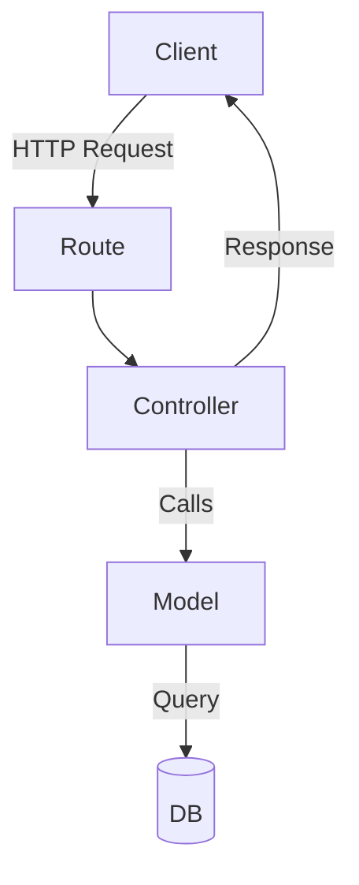
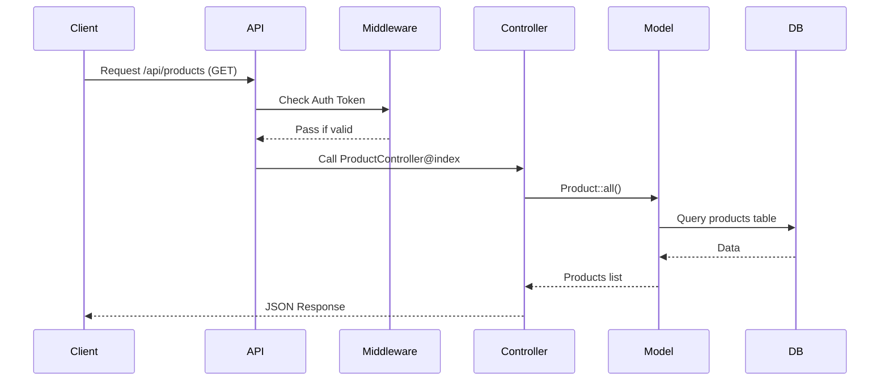
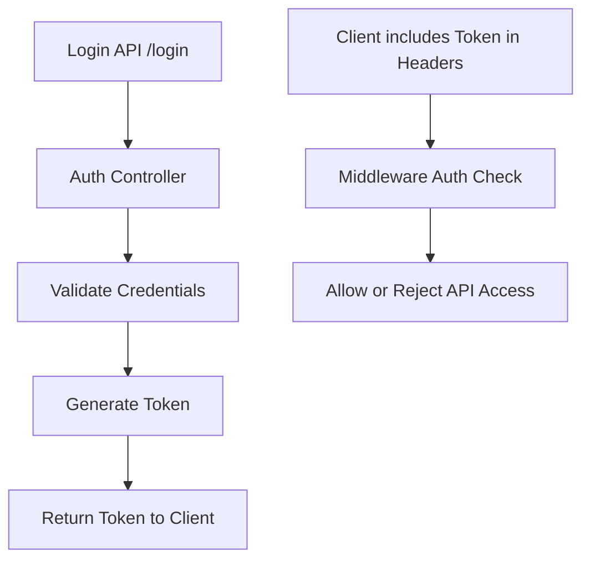
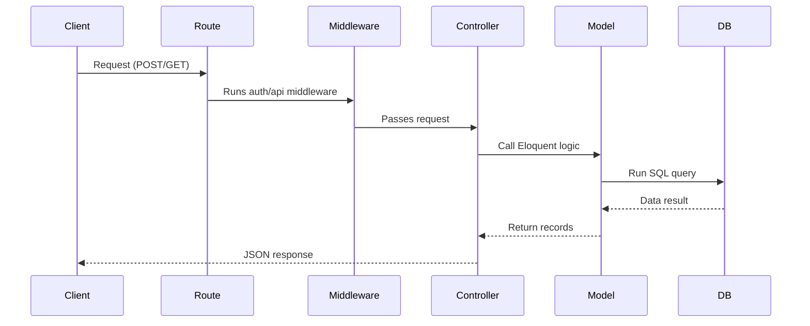
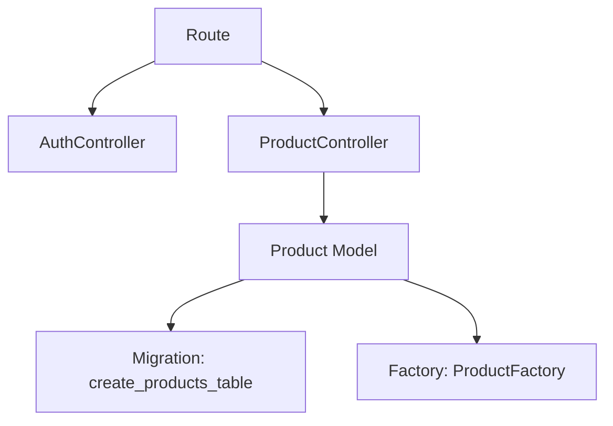
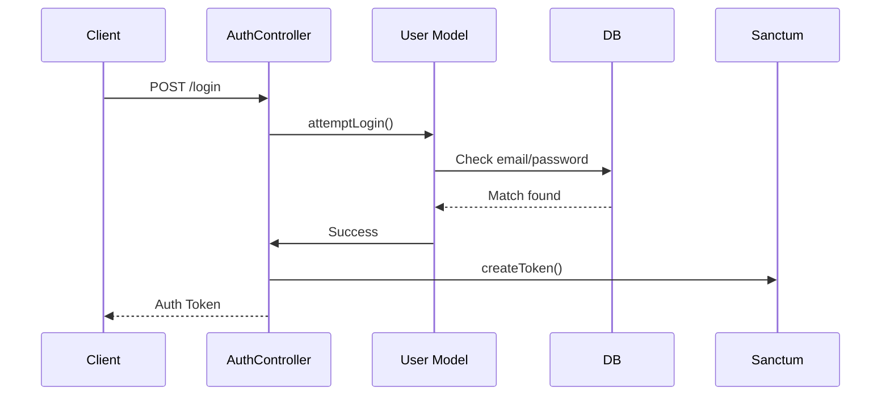

# 📘 Laravel API Control Flow with Authentication

This document outlines the control flow of a Laravel API project with authentication, including routing, controller logic, models, middleware, and database interaction.

---

## 🧠 High-Level Architecture (MVC)

## 🔐 Authenticated API Flow

## 🔐 Authentication System (Laravel Sanctum)

## 🔄 API Request Lifecycle

## 📦 File & Class Structure

## Login Flow
